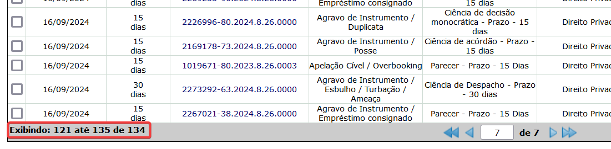

A Agência Nacional de Mineração ([ANM](https://www.gov.br/anm/pt-br)) é uma autarquia federal, vinculada ao Ministério de Minas e Energia, responsável por regular, fiscalizar e promover o setor mineral brasileiro. Ela foi criada em 2017, substituindo o antigo Departamento Nacional de Produção Mineral (DNPM). Principais funções da ANM:

- Emitir autorizações e concessões para pesquisa e lavra mineral.
- Fiscalizar a atividade minerária, incluindo segurança de barragens.
- Gerenciar a Compensação Financeira pela Exploração Mineral (CFEM).
- Promover a transparência e modernização do setor por meio de sistemas digitais como o SIGBM (Sistema Integrado de Gestão de Barragens de Mineração).

<br>

É possível consultar as informações dos processos minerários, bem como identificar as poligonais dos respectivos processos. As informações são georreferenciadas e apresentadas por meio de mapas digitais no formato vetorial e raster, no datum SIRGAS2000. O SIGMINE possui caráter meramente informativo, portanto, não dispensa o uso dos instrumentos oficiais pertinentes para produção de efeitos legais.

Os dados dos processos minerários são atualizados diariamente e podem ser obtidos no [Portal da Geoinformação Mineral](https://geo.anm.gov.br/portal/home/index.html).



<br>

---

## SIGMINE

Por meio do SIGMINE é possível identificar, visualmente, os polígonos dos processos minerários.
Os dados espaciais são disponíbilizados por meio de plataformas _online_, tais como [SIG web da Agência Nacional de Mineração - ANM](https://geo.anm.gov.br/portal/apps/webappviewer/index.html?id=6a8f5ccc4b6a4c2bba79759aa952d908).


A partir do _post_


A partir de _docs_


<br>

---

## Dados Abertos

E é possível obter os dados brutos no [Portal de Dados Abertos do Governo Federal](https://dados.gov.br/dataset/sistema-de-informacoes-geograficas-da-mineracao-sigmine).

- [**Áreas de Bloqueio**](https://dados.gov.br/dataset/sistema-de-informacoes-geograficas-da-mineracao-sigmine/resource/5875be87-a457-4bfc-8981-80ef942a588f): Poligonais das áreas bloqueadas para mineração.
- [**Áreas de Proteção de Fonte**](https://dados.gov.br/dataset/sistema-de-informacoes-geograficas-da-mineracao-sigmine/resource/8d35a5b5-10e1-4d7c-9ec2-d3396d478d05): Poligonais das áreas de proteção de fonte associadas aos processos minerários ativos mantidos pela Agência Nacional de Mineração.
- [**Áreas de Servidão**](https://dados.gov.br/dataset/sistema-de-informacoes-geograficas-da-mineracao-sigmine/resource/aa7fcff4-de14-493a-b918-e746c5c4504b): Poligonais das áreas de servidão associadas aos processos minerários ativos mantidos pela Agência Nacional de Mineração.
- [**Arrendamentos**](https://dados.gov.br/dataset/sistema-de-informacoes-geograficas-da-mineracao-sigmine/resource/aa70cea0-9ecb-4ae3-bb19-260d07890eef): Poligonais dos processos minerários arrendados mantidos pela Agência Nacional de Mineração.
- [**Reservas Garimpeiras**](https://dados.gov.br/dataset/sistema-de-informacoes-geograficas-da-mineracao-sigmine/resource/034961a2-bd25-4790-9754-4b5e53ea2eb2): Poligonais das reservas garimpeiras estabelecidas pela Agência Nacional de Mineração.
- [**Processos minerários ativos - SP - Shapefile**](https://dados.gov.br/dataset/sistema-de-informacoes-geograficas-da-mineracao-sigmine/resource/58e10a83-0eb0-4cf2-a7ab-5941c1e8e096): Poligonais dos processos minerários ativos (incluindo áreas em disponibilidade) mantidos pela Agência Nacional de Mineração.

<br>

Importante observar que existem outras informações públicas.

- https://app.anm.gov.br/dadosabertos/

<br>

---

## ArcGIS

É possível observar que a AMN utiliza o ArcGIS

- https://geo.anm.gov.br/portal/home/item.html?id=6a8f5ccc4b6a4c2bba79759aa952d908

<br>

---

## Cadastro Mineiro

Uma vez com a identificação dos processos minerários, é possível consultados por meio do [Cadastro Mineiro](https://sistemas.anm.gov.br/scm/extra/site/admin/default.aspx).

<br>

---

## Python 2

Apenas para fins de registro histórico, encontrei um _script_ escrito para trabalhar com o [ArcPy](https://www.esri.com/pt-br/arcgis/products/arcgis-python-libraries/libraries/arcpy), de 04.04.2013.

```python
# Cria base de dados do SIGMINE
# 04/04/2013

# 1. Cria Geodatabase
workspace E:\GIS_Outros\BR_CPRM\SIGMINE\Geodata

CreatePersonalGDB_management %workspace% Geo_SIGMINE

workspace E:\GIS_Outros\BR_CPRM\SIGMINE\Geodata\Geo_SIGMINE

CreateFeatureDataset_management %workspace% SIGMINE "GEOGCS['GCS_South_American_1969',DATUM['D_South_American_1969',SPHEROID['GRS_1967_Truncated',6378160.0,298.25]],PRIMEM['Greenwich',0.0],UNIT['Degree',0.0174532925199433]],VERTCS['WGS_1984_Geoid',VDATUM['WGS_1984_Geoid'],PARAMETER['Vertical_Shift',0.0],PARAMETER['Direction',1.0],UNIT['Meter',1.0]];-400 -400 11258999068426,2;-1043,7418235 4194304001953,12;-100000 10000;8,98312044744602E-09;0,001;0,001;IsHighPrecision"

# 2. Importa shapefiles
workspace E:\GIS_Outros\BR_CPRM\SIGMINE\Geodata\shp

FeatureClassToGeodatabase_conversion %workspace%\AC.shp;%workspace%\AL.shp;%workspace%\AM.shp;%workspace%\AP.shp;%workspace%\BA.shp;%workspace%\CE.shp;%workspace%\DF.shp;%workspace%\ES.shp;%workspace%\GO.shp;%workspace%\MA.shp;%workspace%\MG.shp;%workspace%\MS.shp;%workspace%\MT.shp;%workspace%\PA.shp;%workspace%\PB.shp;%workspace%\PE.shp;%workspace%\PI.shp;%workspace%\PR.shp;%workspace%\RJ.shp;%workspace%\RN.shp;%workspace%\RO.shp;%workspace%\RR.shp;%workspace%\RS.shp;%workspace%\SC.shp;%workspace%\SE.shp;%workspace%\SP.shp;%workspace%\TO.shp E:\GIS_Outros\BR_CPRM\SIGMINE\Geodata\Geo_SIGMINE.mdb\SIGMINE
```

<br>

Bem como um _.pdf_ da época, com as instruções para baixar os arquivos no extindo DNPM.

{ type=application/pdf style="min-height:50vh;width:100%" }
